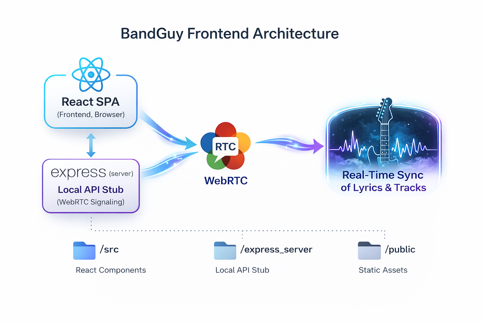

BandGuy helps bands rehearse together online with synchronized playback of lyrics and tracks. 
This repository contains the React frontend SPA. This repo is configured as a monorepo:

- Main Vite Server is 'static', listening on 0.0.0.0:9000 
  - serving up static data from public/
  - It will proxy to the jam/ SPA app port (/jam is listening to port 5173)
  - each sub spa will handle some portion of the over site experience. Looking to not have a single SPA running tons of components, modules, and state. Additional, SPAs are free to choose their own stack (react, vue, svelte, vanilla js)  

## Features (Proof-of-Concept)
- React SPA for local rehearsal sessions
- Browser-based lyric file caching
- Two track playback types
- WebRTC-based network sync

## Repo Structure
- `/apps` – Each subfolder is a SPA of its own. Instead of one massive SPA, hard to deploy, edit, and large memory/download footprint - break major app areas into their own SPAs. For instance, user profile editing has nothing at all to do with jamming. And, we can unload jam SPA when going to edit user profile, or in track builder modes.
- `/public` – Static assets
- `/tests` – Component/unit tests
- `.storybook` – Storybook UI component explorer
- `vite.config.ts` – Vite build configuration

## Running Locally

### Tools
- VSCode
- .Net 10 (Visual Studio or dotnet build/run)
- npm v24
- docker compose

1. Clone the repo:
   - git clone https://github.com/SyncRock/bandguy-frontend-react.git
   - git clone https://github.com/SyncRock/bandguy-api-server.git
2. Install dependencies:
   - npm run install-all
3. Start local dev server + WebRTC stub:
   - npm run dev-jam
4. in bandguy-api-server/docker
   - docker compose up
5. build and run the .Net bandguy-api-server/backend
6. setup a fake host/static in host file: syncup.local 127.0.0.1
7. Open the app in your browser at http://syncup.local:7080/

## Tests
- Run unit/component tests:
  npm run test
- Run Storybook:
  npm run storybook

## Contributing
- Keep experiments in separate branches
- Storybook components should be documented with examples

## Commnuity

## License
GPL-3.0 License — see LICENSE file for details.

## Architecture Diagram

